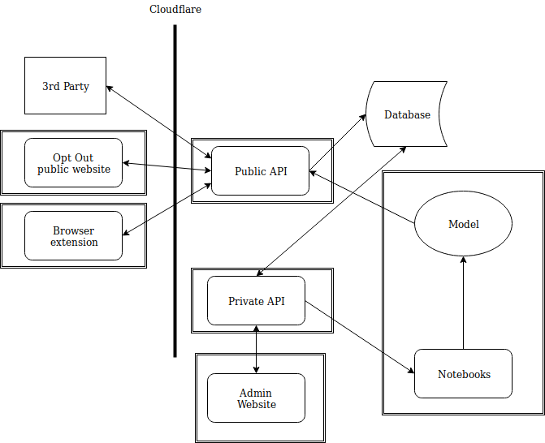

  

 Opt Out Tools 

 We are building a set of tools designed to help female-identifying people engage with healthy online discussion. 
 

  

# Our Mission
The General Data Protection Regulation (GDPR) has changed our lives online on social media platforms. We have the right to be forgotten, to see what is being collected about us and to opt-out if we wish. The current abuse that those who identify as women suffer is not avoidable. We see Opt Out as an extension of the GDPR that also protects the human rights of women and those with intersecting identities online. While steps have been made to protect these people online, not enough has been done. This is a global tragedy affecting the well-being, economical potential and political representation of these people. Let's __Opt Out.__

Our tools include:

- a browser extension that works like adBlocker but removes online misogyny from an individuals Twitter feed instead of adverts
- a website where an individual can anonymously submit details of their online misogyny. This data will be stored, studied and feed the models that our other tools use
- activism: TBC

# To Install / Use
## Browser Extension

The code for the Firefox extension is hosted in a separate repo: [Opt Out](https://github.com/opt-out-tools/opt-out)

To use the current prototype:
1. Clone a local copy of the master branch of the [extension repo](https://github.com/opt-out-tools/opt-out)
2. Start Mozilla Firefox (make sure you have the latest installed v69.0 at least)
3. Set the url to `about:debugging#/runtime/this-firefox` and hit enter
4. In the `Load Teporary Add-ons` box, open and load `manifest.json` which can be found in the `extensions` folder of this repo you cloned locally
5. Open Twitter and test!
6. If you make changes to the code you would like to test, make sure you click "reload" (left of the "remove" button) to apply new changes to script 

## Website
Go to our website [optoutools.com](https://www.optoutools.com) and click the submit a report button to submit details of your experience of online misogyny.

# Our Technologies

## Architecture

Above you can see a drawing of our project's architecture. The browser extension and website front-ends share a common back-end called public_api.

## [Browser Extension](https://github.com/opt-out-tools/opt-out) 
The browser extension removes online misogyny from and individual's Twitter feed, automatically reporting the detected content to the moderators of the platform. Our goal is to have a local implementaiton of the model that the user can supply feedback to and use transfer learning to retrain their model to fit their online interactions.

Tech stack:
- Javascript
- Tensorflow

## [Website Front-end](https://github.com/opt-out-tools/website)
This is the front-end for our website.
Tech stack:
- Javascript
- Angular 8.0

## [Back-end](https://github.com/opt-out-tools/public_api)
This has two API's for the website and the browser extension.
Tech stack:
- Python
- Django

## [Data Science](https://github.com/opt-out-tools/study-online-misogyny)
We study online misogyny here. You can find our current work and our future plans here.

Tech stack:
- Python/R
- Data science (text analytics, network analysis.. etc.)

## Project Development

Opt Out is an open source project under active development. Currently, machine learning models are being evaluated for their ability to classify misogynistic text.  If you would like to contribute to the project, please see [Contributing](https://github.com/malteserteresa/opt-out/blob/master/contributing.md) first, and then check out the repos.

## Funding
If you would like to fund the project or make a donation, please email [Opt Out](mailto:opt-out-tool@gmail.com).

***

> Please note that this project is released with a [Contributor Code of Conduct](https://github.com/malteserteresa/opt-out/blob/master/CODE_OF_CONDUCT.md). By participating in this project you agree to abide by its terms.

