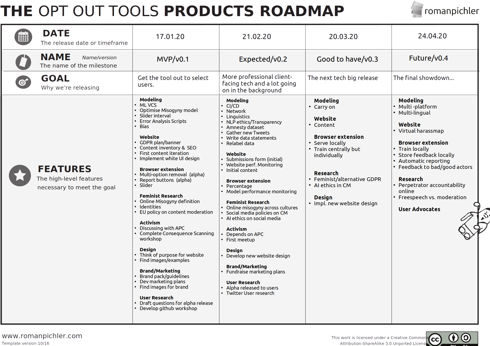
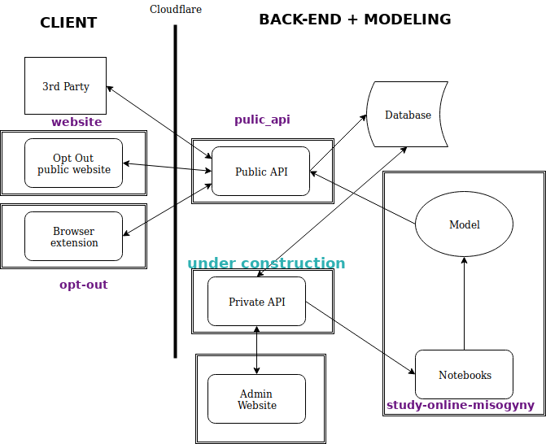

<p align="center">  </p>

<p></p> <h1 align="center"> Opt Out Tools </h1>

<h2 align="center"> We are building tools to remove online misogyny and help
 female-identifying people engage with healthy online discussion </h2>

<p align="center">  </p>


Skip to the bit you want to know about

- [Our Tools and Our Vision](#Our-Tools-and-Our-Vision)
- [Our Roadmap](#Our-Roadmap)
- [The Repos and their Roles](#The-Repos-and-their-Roles)
- [Use Our Tools](#Use-Our-Tools)
- [Develop Our Tools](#Develop-Our-Tools)
- [Our Organisation](#Our-Organisation)
- [Our Code of Conduct](#Code-of-Conduct)
- [Help us with Our Vision](#Help-Our-Vision)
- [Our Mission](#Our-Mission)

# Our Tools and Our Vision

We currently have five tools we're working on to combat online misogyny. Here's
a brief description of each tool:

- **Browser Extension**: works like adBlocker but removes misogyny instead of
  adverts
- **Website**: allows an individual to support and inform themselves
- **Activism**: saying boo to the misogyny gooses 
- **Research**: understanding online misogyny and the problem domain
- **Modeling**: modeling online misogyny with data science

### Our Browser Extension
Our browser extension is designed to remove misogyny from an individual's
social media feed, automatically alerting the moderators of the platform to the
detected abuse. However we are consent and not censorship focused. We’re
designing our browser extension to have a local instance of the model that you
can supply feedback to. By giving the individual control over what they do and
don’t see whilst keeping their data private and upholding their safety, we
hope to show female-identifying people that their voices can be heard online
without the traumatizing consequences.

### Our Website 
Our website aims to support female-identifying getting their voices back
and sustain the movement. Currently the website is only informative about
Opt Out Tools.  However, inspired by [HarassMap](https://harassmap.org/ar),
an Egyptian based NGO that allows people to submit reports of physical
 harassment which are displayed online on a map, our website will allow an
individual to anonymously submit details of their harassment. This data
will be stored, studied and feed the models that our other tools use, for
example the browser extension. Our website will transparently show details
of the usage statistics of the tools and show female-identifying clearly
how their participation by submitting their reports is helping to fuel the
movement and show our "antidote to silicon valley KPIs”. Our long-term
goal is to display a “virtual” harass map on our website, showing which
communities on your selected social media platform are misogynistic or
sexually aggressive or just downright abusive, enabling female-identifying
to navigate the murky waters of online society as best they can.


### Our Activism
We’re holding workshops that give female-identifying people a chance to meet
and share their experiences online. By doing this we not only give much needed
support to these people but allow them to come together and in doing so, act in
a form of protest. By helping to form this community, it helps us identify
needed technical infrastructure and ensures that our tools are fit for purpose
enabling our tech to be as community-driven as possible.

We’re also holding workshops and hackathons to develop our “antidote to silicon
valley KPIs": KPIs that try to measure diversity, inclusivity and health of
online conversation. Current metrics of participation such as no. of shares,
no. of clicks etc. have ensured that the social media tech giants live in the
pockets of most people on the planet. But these simple metrics of participation
don’t tell the full story. We want to do it differently.

### Our Research
Our tech is here to solve real-world problems. It's vital to us that we compile
and understand the latest research around online misogyny to inform our
technical decisions.

We're designing a research roadmap which will be used to compile research
about many aspects of online life. Our initial focus shall be on online
misogyny, how it is currently defined by various actors, the cause and
effects and what online misogyny means to Opt Out Tools. 

As our research grows we will widen our focus to look into ethical AI and
content moderation online, what is currently being done in these spaces and
how we can help or do it better.

 
### Our Modeling
Language is incredibly nuanced. Our strategy is to develop a misogyny model 
that removes misogyny targeted at a particular group of female-identifying 
people being harassed online. By initially targeting our protection to a 
specific group of people, we will improve the accuracy of our model, ensuring 
that we remove what is truly misogynistic to this group and nothing else. As we 
better understand online misogyny and how to model it we will improve our model 
to have an increased range of groups whom our tool is of use to.

Currently we are focusing on Twitter and using Natural Language Processing to 
understand the sentiment of a tweet. However this is a very simple model of how 
language works. Language has content, context, is part of a conversation and 
has meaning embedded in the words. To capture this and make our machine 
learning models as precise as possible, we will eventually include network 
analysis, computational linguistics and other techniques, so that we are as 
sure as we can be that the comment is misogynistic.

Also it is important to state here our commitment to understanding the biases
and implications of the modeling that we are doing. We will also be looking
into fairness metrics, dialect identification and model bias to understand and
communicate the limitations of our work. We understand that misogyny sounds
different in different dialects or social groups, and our model should
understand that to avoid potential biases against any particular group of
people.


## Where we are now
### Browser Extension
We have curated a misogyny dataset and have built a binary classifier misogyny
model which is the model behind the basic implementation of the browser
extension. The browser extension is only available to use via
[GitHub](https://github.com/opt-out-tools/opt-out).

### Website
Our website is up and can be found at
[optoutools.com](https://www.optoutools.com) but we need to improve its content
and design, and work on some GDPR related issues, where we need help. Due to
this, the report functionality is currently not activated. If you can
contribute any of these we'd be eternally grateful.

### Activism
We've held multiple workshops, not just around the topic of online misogyny. 

Our workshops include:

- Can we Measure the Inclusivity of Online Discussions?
- Consequence Scanning for Opt Out and Online Content Moderation
- Online Harassment: Let's talk.

If you'd like to know more about these, please each out at
[@OptOutSocial](https://twitter.com/optoutsocial).

### Research
We've done thorough research up until now but there are gaps. We have a
definition of misogyny, an idea of the problem domain but there's a still a lot
to do. It's time to decide on a research roadmap. This roadmap is expected to
include researching different definitions of misogyny at different levels,
sociolinguistic study of misogyny and more.

### Modeling
We have a misogyny dataset and model, but we need to know how it's doing. We're
currently in the process of writing error analysis scripts to do just that.
We're also looking at more complex approaches such as deep learning models.

## Our Vision
At Opt Out Tools, we’re building tools to help all female-identifying
people with something to say, trust that they can take part in healthy online
discussion safely. We want social media platforms to be a **respectful**
place where any can comment without fear of viscous retaliation, **inclusive**
so all voices can flourish and **safe** so no person has to worry about what
happens after they switch off their laptop. We want the social networks to be
better for all.  We want to achieve this by building tools and an organisation
that with these values and consent, privacy and transparency at its core.


<p align="center"> * * * </p>


## Our Roadmap 

<p align="center">  </p>

For further details of the next steps for each of the tools and other work
please see the Roadmaps. *Please note, the Roadmaps will be more up to date
 than the image, so **do** look at the links below*

- [Browser Extension](https://github.com/orgs/opt-out-tools/projects/38)
- [Website](https://github.com/orgs/opt-out-tools/projects/40)
- [Activism](https://github.com/orgs/opt-out-tools/projects/37)
- [Research](https://github.com/orgs/opt-out-tools/projects/42)
- [Modeling](https://github.com/orgs/opt-out-tools/projects/41)
- [Design](https://github.com/orgs/opt-out-tools/projects/44)
- [User Research](https://github.com/orgs/opt-out-tools/projects/45)
- [Brand/Marketing](https://github.com/orgs/opt-out-tools/projects/43)

<p align="center"> * * * </p>


# The Repos and their Roles
An overview of the repositories we have an what they are there for

- [opt-out](https://github.com/opt-out-tools/opt-out): the front-end for the
  browser extension
- [website](https://github.com/opt-out-tools/website): the front-end for the
  website
- [public_api](https://github.com/opt-out-tools/public_api): the joint back-end
  for the website and browser extension
- [theory-of-online-misogyny](https://github.com/opt-out-tools/theory-of-online-misogyny):
  qualitative research into online misogyny
- [study-online-misogyny](https://github.com/opt-out-tools/study-online-misogyny):
  quantitative research into online misogyny

<p align="center"> * * * </p>

# Use Our Tools
## Browser Extension

Our browser extension works only on Firefox. The code to load the browser
extension can be found in [opt-out](https://github.com/opt-out-tools/opt-out).

To use the current version:
1. Clone a local copy of the master branch of the [extension
   repo](https://github.com/opt-out-tools/opt-out)
2. Start Mozilla Firefox (make sure you have the latest installed v69.0 at
   least)
3. Set the url to `about:debugging#/runtime/this-firefox` and hit enter
4. In the `Load Teporary Add-ons` box, open and load `manifest.json` which can
   be found in the `extensions` folder of this repo you cloned locally
5. Open Twitter and test!
6. If you make changes to the code you would like to test, make sure you click
   "reload" (left of the "remove" button) to apply new changes to script

## Website
Go to our website [optoutools.com](https://www.optoutools.com) and click the
submit a report button to submit details of your experience of online misogyny.

## Study Online Misogyny
Look at the
[notebooks](https://github.com/opt-out-tools/study-online-misogyny/tree/master/notebooks)
to see our modeling efforts.

Disclaimer: the data includes harsh and misogynistic statements. Avoid looking
at the data if that's a trigger for you.

## Activism 
Our twitter handle is [@OptOutSocail](https://twitter.com/optoutsocial), spread
our message!

## Research
Checkout the [theory of online
misogyny](https://github.com/opt-out-tools/theory-of-online-misogyny) and its
[wiki](https://github.com/opt-out-tools/theory-of-online-misogyny/wiki)

<p align="center"> * * * </p>

# Develop Our Tools
## Status of Repos
Is anything broken? 
- [opt-out](https://github.com/opt-out-tools/opt-out):
  [](https://circleci.com/gh/opt-out-tools/opt-out)
- [study-online-misogyny](https://github.com/opt-out-tools/study-online-misogyny):
  [](https://circleci.com/gh/opt-out-tools/study-online-misogyny)

## The Opt Out Tools Architecture
Here is a diagram depicting the technical architecture of Opt Out Tools.

<p align="center">  </p>

```
A key:
- square boxes are different repositories
- purple labels are the repository where the code for the component lives 
- blue is not implemented yet
- arrows indicate information exchange and flow
```

The browser extension and website share a common back-end called public_api.
Documentation for these two APIs can be find in the
[public_api](https://github.com/opt-out-tools/public_api) repo.

It is important to note that we do not currently have an automated model
deployment mechanism.

## Browser Extension Front-end
The browser extension removes online misogyny from an individual's Twitter
feed. We have a binary classifier model deployed on some servers and as the
page loads the tweets are sent to the backend, the model is hit and returns a
score. If the misogyny score is above the threshold set by the user, the text
is blocked out, if not it’s left on the page. If there is an image attached to
the comment that is also blocked.

Tech stack:
- Javascript

For further details on developing it [click
here](https://github.com/opt-out-tools/opt-out)

## Website Front-end
This is the front-end for our website.
Tech stack:
- Javascript
- Angular 8.0

For further details on developing it [click
here](https://github.com/opt-out-tools/website)

## The Back-end
This has two API's for the website and the browser extension.
Tech stack:
- Python
- Django

For further details on developing it [click
here](https://github.com/opt-out-tools/public_api)

## Modeling
We study online misogyny here. You can find our current work and our future
plans here.

Tech stack:
- Python/R
- Data science (text analytics, network analysis.. etc.)

For further details on developing it [click
here](https://github.com/opt-out-tools/study-online-misogyny)

## Activism & Research
Go to the [theory of online
misogyny](https://github.com/opt-out-tools/theory-of-online-misogyny) and
contribute to the issues or wiki.

<p align="center"> * * * </p>

# Our Organisation

## Teams and Focus
The only thing better than being able to work on a project that really means
something, is being able to work on it with a community of great people.

We have experts from across the world working with a variety of skills from UX
to network analysis. More transparency to come.

<p align="center"> * * * </p>

# Code of Conduct
Please note that this project is released with a [Contributor Code of
Conduct](https://github.com/malteserteresa/opt-out/blob/master/CODE_OF_CONDUCT.md).
By participating in this project you agree to abide by its terms.

## Disclaimer
Our intention is to **never ever** re-victimize anyone. However we deal with
explicit content and sometimes we forget to sanitize a work or add a disclaimer
that it may content explicit content. If this happens, please let us know and
we'll rectify the matter immediately.

<p align="center"> * * * </p>

# Help Our Vision

## Contributing
Opt Out Tools is an open source project under active development. Currently, 
machine learning models are being evaluated for their ability to classify
 misogynistic text. If you would like to contribute to the project, please see
the [CONTRIBUTING.md](https://github.com/opt-out-tools/start-here/blob/master/CONTRIBUTING.md)
first, and then check out the CONTRIBUTING.md for the repo you want to work on.

A 5 second contribution can be to :star: the [opt-out
repo](https://github.com/opt-out-tools/opt-out), the more stars we get the more
likely we are to get funding :smile:

## Funding
If you would like to fund the project or make a donation, please email [Opt
Out Tools](mailto:opt-out-tool@gmail.com) or hit the sponsor button above
, which will take you to our [Open Collective](https://opencollective.com/opt-out) page.

<p align="center"> * * * </p>

# Our Mission
We’re a mixed team, including social sciences, UX and lots of data nerds.
We’re all working voluntarily in our spare time to make the internet accessible
for all. What’s most important about us is that we’re a group of people that
**wont let hate win**.

We want to champion female-identifying people back into the online worlds
they’ve been chased out of, support them and their voices whilst still
protecting them and holding the perpetrators accountable. **We need to exist**.

If you share our vision, we ask you to **join us**. Whether it’s by talking
about this to a friend, contributing, research, expertise, skills, strategy or
code. Online misogyny is real and it's silencing the voices that society so
desperately needs to hear.
  
<h3 align="center"> Let’s Opt Out</h3>

<p align="center">  </p>

- [1] https://www.theguardian.com/technology/2016/apr/12/the-dark-side-of
-guardian-comments
- [2] https://decoders.amnesty.org/projects/troll-patrol/findings
- [3] https://www.buzzfeednews.com/article/zahrahirji/greta-thunberg-climate-teen-activist-harassment
